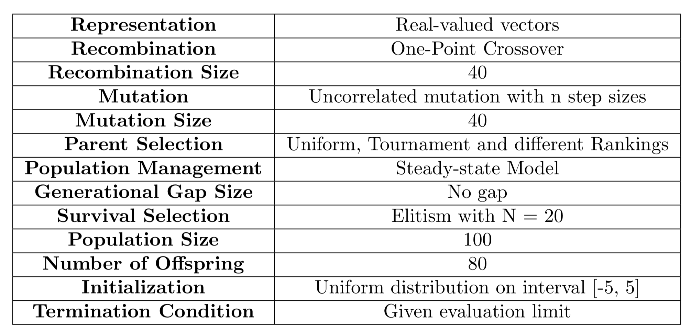
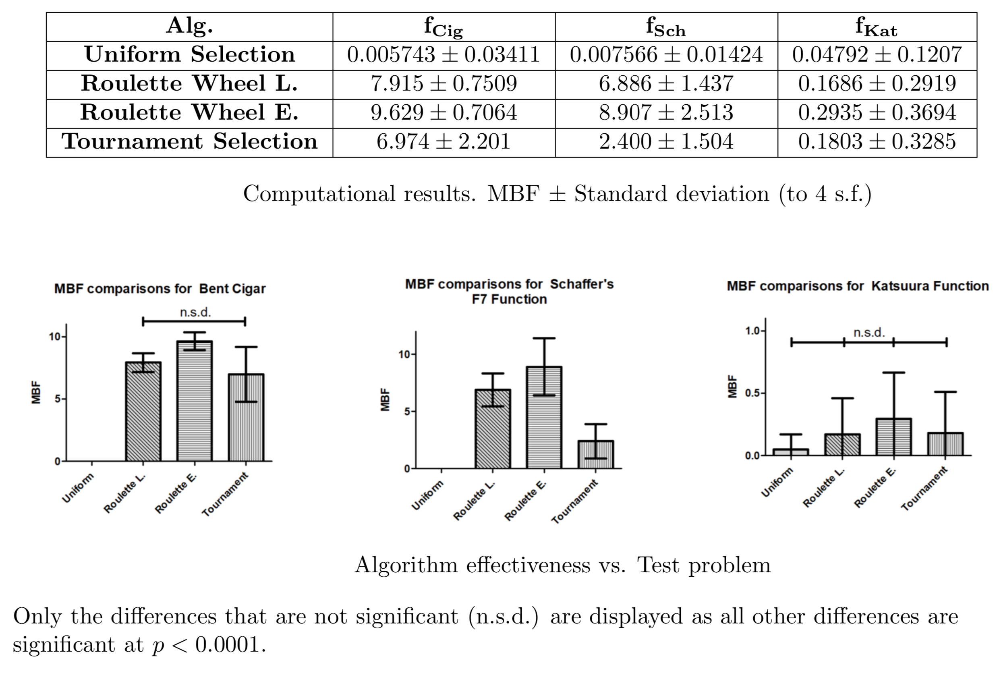
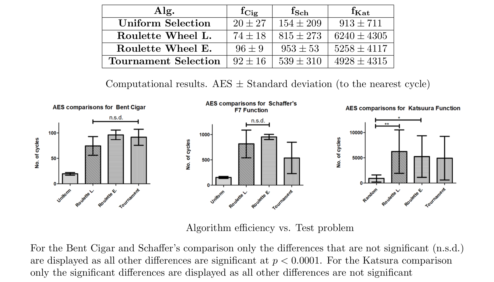
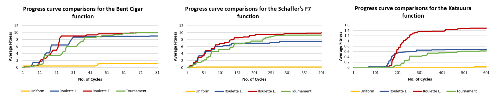

# Evolutionary Computing

## Description
Welcome to our __Evolutionary Computing__ reposetory! Here you will find our implimatation of an evolutionary algorithm in order to find the maximum of three 10-dimensional continuous functions, namely _Bent Cigar_, _Katsuura_, and the _Schaffers F7_.

  

    Algorithm Summary.

## Task
In the current work our aim was to examine the effect of different parent selection schemes on algorithm performance in multidimensional optimization problems. We hypothesized that different parent selection mechanisms amount to different behaviour of the evolutionary search, by adjusting the balance of exploration versus exploitation. To test our hypothesis we designed and implemented four instances of the same EA, differing only in the parent selection mechanism, in maximizing three 10-dimensional continuous optimization problems, known as Bent Cigar (fCig), Katsuura (fKat), and the Schaffers F7 function (fSch). Each test problem addresses different aspects of the exploitative and exploratory properties of the search. We then compared the performance of each algorithm on each of these problems to analyze the effect of each parent selection scheme. In particular, we looked at Roulette wheel selection with linear ranking (Roulette L.), Roulette wheel selection with exponential ranking (Roulette E.), Tournament selection and Uniform selection, used as a control.

## Results

To quantify the effectiveness of each algorithm we used the __Mean Best Fitness__ measure (__MBF__) over all runs. This is the average fitness value of the best individual in each run for each algorithm, in each problem over 100 runs. The Roulette E. selection algorithm outperformed all other algorithms in all test problems, although it was only significant in fCig and fSch. The Roulette L. and Tournament selection algorithms were second best, outperforming the Uniform selection algorithm in all test problems, but it was also only statistically significant in fCig and fSch. The Roulette L. selection method performed significantly better than the Tournament selection algorithm in fSch but not in the other test problems. Results are displayed below.

  

To quantify the efficiency of each algorithm we used the __average number of evaluations__ to a solution (__AES__) measure; that is, we evaluated the average of the cycle number in which the highest fitness first occurs over 100 runs. With respect to the AES, the Roulette E. selection algorithm was better in fCig and fSch, although it was not statistically significant. Again the Uniform selection algorithm had the lowest perfor- mance compared in all test problems compared to the other algorithms but in fKat the difference with the Tournament selection algorithm was not significant. Results are displayed below.

  

Finally we looked further into the effectiveness and efficiency of each algorithm by constructing progress curves for each test problem. 

  

    Progress curves for each experiment.

###### _Acknowledgement - References_

_This project was our lab assignment for the [Evolutionary Computing](https://vu.nl/nl/studiegids/2018-2019/master/p-r/parallel-and-distributed-computer-systems/index.aspx?view=module&origin=50049363&id=50049469) course of the MSc in Artificial Intelligence at the University of Amsterdam/ VU._